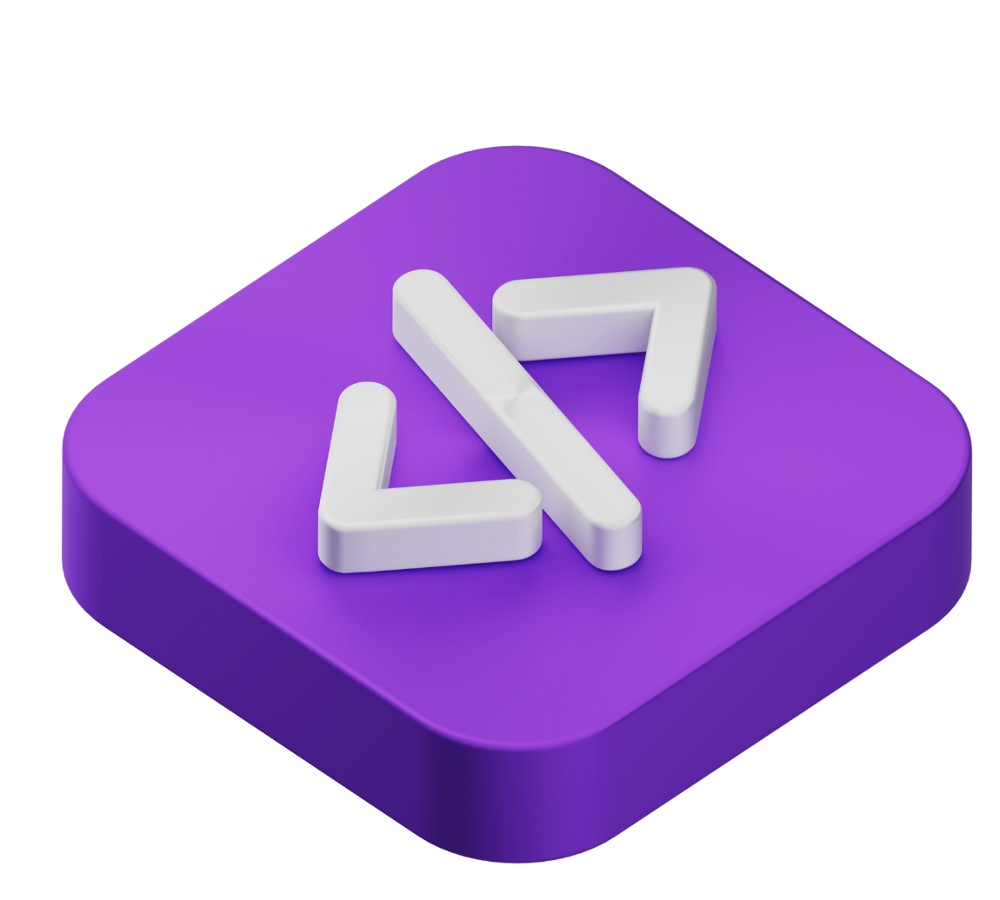

# VibeStudio

A powerful desktop application built with Electron, React, and TypeScript for managing virtual machines and development environments.



## 🚀 Features

- **Virtual Machine Management**: Create, monitor, and manage virtual machines
- **Code Editor**: Built-in code editor with syntax highlighting for multiple languages
- **File System Explorer**: Browse and manage files in your virtual environments
- **Terminal Integration**: Integrated terminal for command-line operations
- **Deploy Manager**: Deploy applications and manage deployments
- **Real-time Monitoring**: Monitor VM resources and performance
- **Dark/Light Theme**: Toggle between dark and light themes
- **Auto-updates**: Automatic application updates
- **Cross-platform**: Works on macOS, Windows

## 📋 Prerequisites

Before setting up the project, ensure you have the following installed:

- **Node.js** (v18 or higher)
- **npm** (v9 or higher)
- **Git**
- **Python** (for node-pty native module)

### macOS Additional Requirements
- **Xcode Command Line Tools**: `xcode-select --install`
- **Apple Developer Account** (for code signing and notarization)

### Windows Additional Requirements
- **Visual Studio Build Tools** or **Visual Studio Community**
- **Windows SDK**

## 🛠️ Installation & Setup

### 1. Clone the Repository
```bash
git clone <repository-url>
cd native_node_electronjs
```

### 2. Install Dependencies
```bash
npm install
```

The project includes a preinstall script that installs sharp with wasm32 CPU architecture, which is handled automatically.

### 3. Download Platform-Specific Binaries

Before running the application, download the required platform-specific binary files:

#### For macOS:
```bash
curl -L https://nativenode.s3.ap-southeast-1.amazonaws.com/mac/bin.zip -o mac-bin.zip
unzip mac-bin.zip -d public/bin/
rm mac-bin.zip
```

#### For Windows:
```bash
curl -L https://nativenode.s3.ap-southeast-1.amazonaws.com/windows/bin.zip -o windows-bin.zip
unzip windows-bin.zip -d public/bin/
rm windows-bin.zip
```

### 4. Environment Setup

Create a `.env` file in the root directory with the following variables:
```bash
# Apple Developer Configuration (for macOS builds)
APPLE_ID=your-apple-id@example.com
APPLE_APP_SPECIFIC_PASSWORD=your-app-specific-password
APPLE_TEAM_ID=your-team-id
APPLE_CERTIFICATE_PASSWORD=your-certificate-password

# Other environment variables as needed
```

### 5. Development Setup

Start the development server:
```bash
npm run dev
# or
npm start
```

This will start both the Vite development server and Electron in development mode.

## 🏗️ Building the Application

### Development Build
```bash
npm run build
```

### Platform-Specific Builds

#### macOS
```bash
# Standard macOS build
npm run build

# Mac App Store build
npm run build-mas

# Using Makefile (recommended for macOS)
make build-mac
```

#### Windows
```bash
npm run build-win
```

### Advanced macOS Build Process

For production macOS builds with code signing and notarization:

```bash
# Complete production build with signing and notarization
make publish
```

This will:
1. Clean previous builds
2. Install dependencies
3. Build the application
4. Sign the application and binaries
5. Create a ZIP file for auto-updates
6. Notarize with Apple
7. Staple the notarization
8. Verify the final build

## 📁 Project Structure

```
native_node_electronjs/
├── electronApp/                 # Electron main process
│   ├── index.ts                # Main electron entry point
│   ├── preload.ts              # Preload script
│   ├── auto-update-manager.ts  # Auto-update functionality
│   └── server/                 # Built-in server
├── src/                        # React renderer process
│   ├── components/             # React components
│   ├── pages/                  # Application pages
│   ├── hooks/                  # Custom React hooks
│   ├── services/               # API services
│   ├── store/                  # State management (Zustand)
│   ├── types/                  # TypeScript type definitions
│   └── utils/                  # Utility functions
├── public/                     # Static assets
│   ├── bin/                    # Binary executables
│   └── icons/                  # Application icons
├── dist/                       # Vite build output
├── dist-electron/              # Electron build output
└── release/                    # Final built applications
```

## 🔧 Available Scripts

- `npm start` - Start development server
- `npm run dev` - Start development server (alias)
- `npm run build` - Build for production
- `npm run build-win` - Build for Windows
- `npm run build-mas` - Build for Mac App Store
- `npm run clean` - Clean build artifacts
- `npm run prebuild` - Clean before build

### Makefile Commands (macOS)
- `make install` - Install dependencies
- `make build-mac` - Build for macOS
- `make sign` - Code sign the application
- `make notarize` - Notarize with Apple
- `make verify` - Verify code signing
- `make publish` - Complete production build process

## ⚙️ Configuration Files

- **package.json** - Project dependencies and scripts
- **vite.config.ts** - Vite configuration
- **electron-builder.yml** - Electron Builder configuration
- **tailwind.config.ts** - Tailwind CSS configuration
- **tsconfig.json** - TypeScript configuration
- **Makefile** - Build and deployment automation

## 🎨 Technology Stack

### Frontend
- **React** 19.1.0 - UI framework
- **TypeScript** - Type safety
- **Tailwind CSS** - Styling
- **Radix UI** - UI components
- **React Router** - Navigation
- **Zustand** - State management
- **React Query** - Data fetching

### Backend/Electron
- **Electron** 32.1.0 - Desktop framework
- **Node.js** - Runtime
- **Express** - Built-in server
- **node-pty** - Terminal emulation
- **systeminformation** - System monitoring

### Development Tools
- **Vite** - Build tool and dev server
- **Electron Builder** - Application packaging
- **ESLint** - Code linting
- **Prettier** - Code formatting

## 🔐 Code Signing & Distribution

### macOS Code Signing
1. Ensure you have a valid Apple Developer certificate
2. Update the `APPLE_*` environment variables in `.env`
3. Place your certificate file as `certificate.p12` in the root directory
4. Run `make publish` for complete signed build

### Auto-Updates
The application includes auto-update functionality using `electron-updater`. Updates are served from:
```
https://releases.vibestud.io/vibestudio/
```

## 🚨 Troubleshooting

### Common Issues

1. **Native Module Build Errors**
   ```bash
   # Rebuild native modules
   npm rebuild
   ```

2. **Sharp Installation Issues**
   ```bash
   # Install sharp manually
   npm install --cpu=wasm32 sharp --no-save
   ```

3. **Electron Build Fails**
   ```bash
   # Clear cache and rebuild
   npm run clean
   npm install
   npm run build
   ```

4. **Code Signing Issues (macOS)**
   - Verify your Apple Developer certificate is valid
   - Check the certificate password in `.env`
   - Ensure Xcode Command Line Tools are installed

### Debug Mode
Start the application with debug logging:
```bash
DEBUG=* npm start
```

For support and questions:
- **Email**: info@aivf.io
- **Issues**: Create an issue in this repository